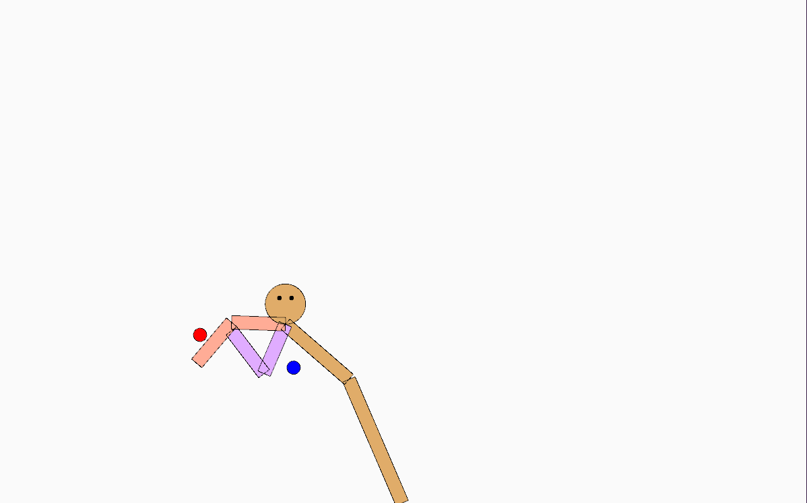
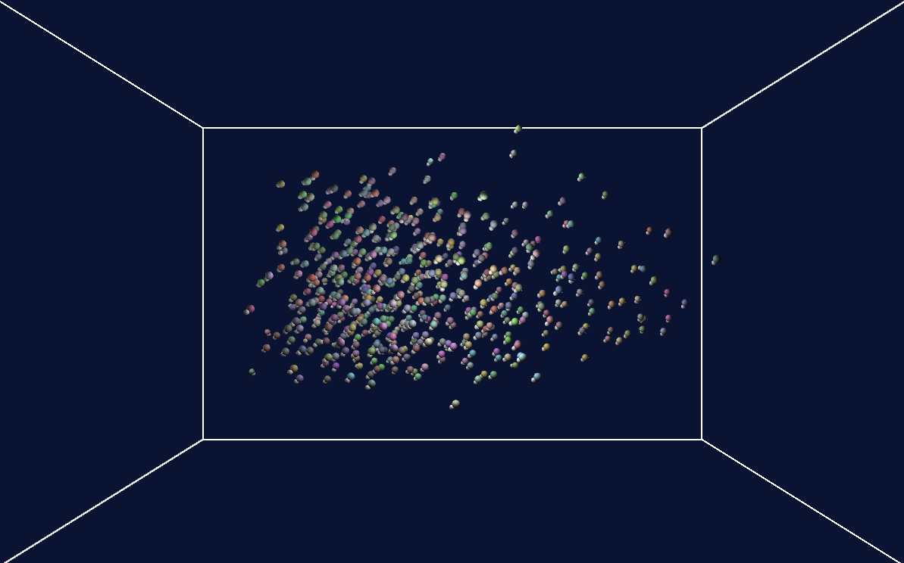

# IK and Flock Simulations

A multi-arm inverse kinematics and Flock simulations, created for CSCI 5611 by Omar Salem

## Demo
[IK - YouTube Demo](https://youtu.be/T7RYo2WoE4c)

[Flock - YouTube Demo](https://youtu.be/9-aUSTgmDn0)

### Features & Timestamps
#### Part 1 - IK:

1. 00:38 - Single-arm IK/Multi-arm IK

    The arms are a total of 5 joints with the joint at the bottom of the screen being the rooted joint that does not move, and the joint between the red and purple arms being a shared joint that either arm can control and take control of. The IK system will only use the arm that is closest to the object to reach out for the goal, and it can be seen what happens when it cannot reach it, or when it does. Both arms can be seen in use and behave in a similar way.

2. 01:15/01:43 - Joint Limits

    It can be seen that the rooted joint and the joint right above it both have angle restrictions that stop them from bending too far down close to the ground. Additionally, it can be seen later that the IK system also has a speed restriction, and pressing 'z' will disable these restrictions and it's possible to see how the lack of angle or speed restrictions effect the system. 

3. 00:25/02:28 - User Interaction
    
    The user can control where the arms (red and purple) are trying to reach and observe how the IK system moves the body to try to reach out for the arm. Only the closest arm will move towards the blue goal, and the body is rooted in place at the joint near the bottom of the screen. The user can also let the arms reach the goal and it will move the blue goal to the red circle and respawn the goal and can disable this by pressing 'r'.

#### Part 2 - Flock:

1. 00:00 - 3D Simulation + 3D Rendering & Camera

    It's clear from the beginning that the simulation is rendered in 3D. There is a box to show the rough area where the boids are set to move in, and they will turn once they get close to a border. The camera can be moved for different viewing angles and I tried to make sure the depth is obvious by having some lighting around some of the borders of the box. The simulation itself is also in 3D and they will move along all axes.

2. 1:15 - Flocking

    When starting the simulation it is clear how the boids will start following the nearby ones and also try to avoid the edges of the box. They will try to also match the velocity and you don't really see any of them go faster than the others once they do join up with a group. I tuned it in a way that they mostly move in one big group, but with different initial positions/velocities, different parameters, or a different number of boids they can also join each other in smaller but separate groups around the box.

## Difficulties Encountered
No difficulties were encountered for the IK. It was fairly straight forward to transform the given in-class code to multiple arms and limit the joints.

As for the Flock simulation, it was relatively easy as well, however it was just very time consuming adjusting the parameters to get the boids to flow nicely, as well as adjusting the code that gave the average position and velocity from nearby boids because that was the main thing that took a while to tune to get the boids to transition nicely from their own velocity and slowly join a nearby group of boids.

Additionally, when simulating in 3D I had this weird trouble with the boids every single time, without fail, always wanting to group up and moving in the -Z direction. It took a lot of time to fix because it was mostly about tuning, and adding turning when it reaches bounds.

## Libraries Used
No external libraries outside of the provided Processing libraries were used.

## Attribution

Code can be found on the [github page](https://github.com/omsa0/IK-and-Flock/)

All code was either written by me or provided in class